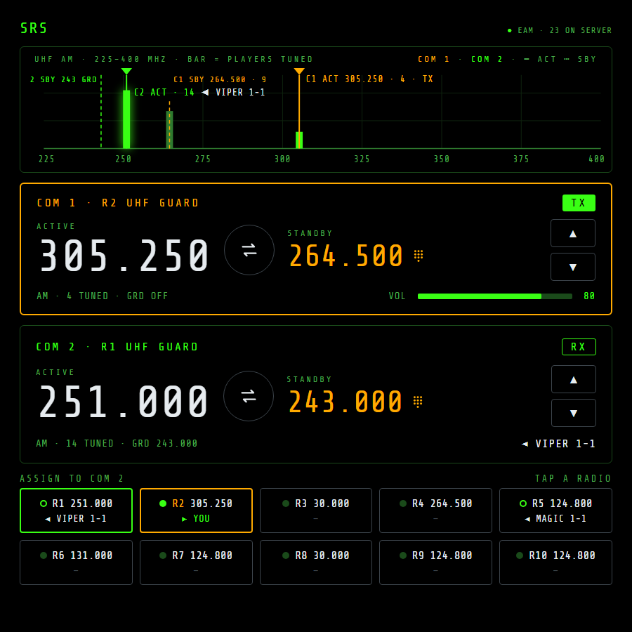

# NOXMFD Extension: SRS

[](https://github.com/roke77/NOXMFD)
[](https://github.com/ciribob/DCS-SimpleRadioStandalone)
[](https://github.com/roke77/NOXMFD-Extension-SRS/releases)
[](LICENSE)

Adds an **SRS** page to [NOXMFD](https://github.com/roke77/NOXMFD)'s browser MFD that shows your
[SRS](https://github.com/ciribob/DCS-SimpleRadioStandalone) (DCS SimpleRadio Standalone) radios:
what every radio is tuned to, who is talking on which one, and when you're transmitting, on a
tablet or second screen instead of SRS's overlay.

Built entirely through NOXMFD's public extension API (see
[`EXTENSIONS.md`](https://github.com/roke77/NOXMFD/blob/main/EXTENSIONS.md)). It reads SRS's own
local state broadcast, so it doesn't modify NOXMFD or SRS.

> [!IMPORTANT]
> **Install order:** BepInEx 5 → [NOXMFD](https://github.com/roke77/NOXMFD) (≥ 0.59.0) →
> **`NOXMFD.SrsModule.dll`**. SRS runs separately, on the same PC, in **External AWACS Mode**.

---

## Table of contents

- [Features](#features)
- [Using the page](#using-the-page)
- [Installing](#installing)
- [Settings](#settings)
- [Links](#links)
- [What's here](#whats-here)
- [Building](#building)
- [Credits](#credits)

---

## Features

- **Band scope** for COM 1's band (UHF AM, VHF AM or VHF FM): a bar for every frequency your radios
  are on, as tall as the number of players tuned to it, with guard frequencies marked. A bar glows
  while you're hearing someone on it, with their name beside it.
- **Two radio heads.** COM 1 is the radio SRS transmits on (its selected radio); COM 2 shows the next
  radio. Each shows the frequency, TX/RX, modulation, players tuned, guard, and the speaker or
  volume.
- **Every radio at a glance:** R1–R10 with frequency and who's talking, `► YOU` while you transmit.
- **Tune from the page.** Each head has a standby frequency: step it with ▲▼ or tap it to type one
  on the keypad, then swap it in. Tap a head to select it, then tap a radio to put it on that COM
  (COM 1 changes the radio SRS transmits on). Tap GRD to toggle guard, and tap the VOL bar to set
  the volume. Standby frequencies and your COM 2 radio are remembered in the browser.
- Follows SRS live: select or retune a radio in SRS's overlay and the page follows.
- When SRS isn't running, has stopped sending, or its port is taken, the page says so instead of
  showing stale radios.



---

## Using the page

1. Start SRS and connect to your server in **External AWACS Mode** (EAM).
2. Start a mission, then open **EXT → SRS** in NOXMFD.

The page shows SRS state only while a mission is running; at the main menu it waits.

---

## Installing

1. Install BepInEx 5 and [NOXMFD](https://github.com/roke77/NOXMFD) 0.59.0 or later.
2. Download `NOXMFD.SrsModule_<version>.zip` from the
   [latest release](https://github.com/roke77/NOXMFD-Extension-SRS/releases/latest) and extract it
   into `BepInEx/plugins/`.
3. Install [SRS](https://github.com/ciribob/DCS-SimpleRadioStandalone/releases/latest) on the same
   PC. When its installer asks, you don't need the DCS client scripts.
4. Launch the game. An **SRS** entry appears under NOXMFD's EXT nav.

---

## Settings

In `BepInEx/config/com.roque.srs-module.cfg` (or BepInEx's configuration manager):

- **State port** (default `7082`): the UDP port SRS sends its radio state to. Change it only if
  another program already uses 7082, and set the same port in SRS's settings.
- **Command port** (default `9040`): the UDP port SRS listens on for commands. Match it to SRS's
  setting if you've changed that.

Restart the game after changing either.

---

## Links

- [Releases and changelog](https://github.com/roke77/NOXMFD-Extension-SRS/releases)
- [NOXMFD](https://github.com/roke77/NOXMFD): the browser MFD this page runs in
- [SRS](https://github.com/ciribob/DCS-SimpleRadioStandalone): the radio client this page reads
- [Design and roadmap](docs/srs-plan.md)

---

## What's here

- `src/plugin/Plugin.cs` registers the **SRS** EXT page and publishes SRS's latest state.
- `src/plugin/SrsListener.cs` receives SRS's state packets on UDP 127.0.0.1:7082.
- `src/plugin/SrsCommands.cs` takes the page's commands and sends them to SRS on UDP 9040;
  `SrsCommandMap.cs` is the allow-list, checked by `dotnet run --project tools/cmdcheck`.
- `src/plugin/SrsPageAssets.cs` serves the embedded `src/web/` files.
- `src/web/srs.{html,css,js}` is the page; `srs-format.js` holds its pure helpers, checked by
  `node src/web/srs-format.test.js`.
- `docs/samples/` holds captured SRS packets; `tools/preview.py` previews the page in a browser
  with them.
- `lib/NOXMFD.dll` is a compile-time reference only, not shipped to players.

---

## Building

Requires a local Nuclear Option install with BepInEx 5 and NOXMFD. If the game isn't at the default
Steam path, create a gitignored `GameDir.props` next to the `.csproj`:

```xml
<Project><PropertyGroup>
  <GameDir>D:\SteamLibrary\steamapps\common\Nuclear Option</GameDir>
</PropertyGroup></Project>
```

```bash
dotnet build SrsModule.csproj -c Release
```

The build copies `NOXMFD.SrsModule.dll` into `$(GameDir)\BepInEx\plugins\`.

To check the page without the game, run `python tools/preview.py 8791` and open
`http://localhost:8791/`. It reads NOXMFD's shared assets from a sibling `../NOXMFD` checkout (or a
path given as the second argument); `/scenario?s=<name>` switches the mock state, as listed in the
script's header, and `/scenario?s=live` reads a running SRS instead.

---

## Credits

- [SRS](https://github.com/ciribob/DCS-SimpleRadioStandalone) by ciribob and contributors, which
  does all the radio work.
- [NOXMFD](https://github.com/roke77/NOXMFD) by roke77.
